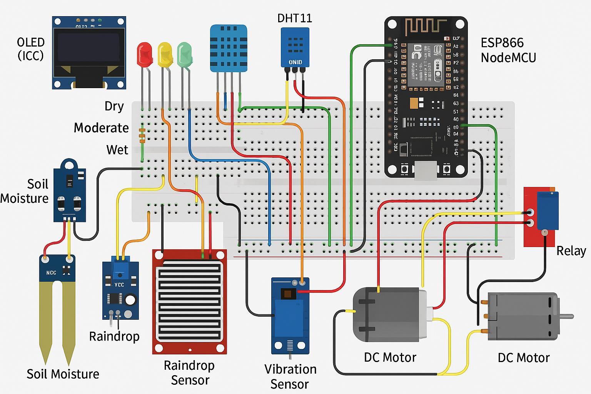
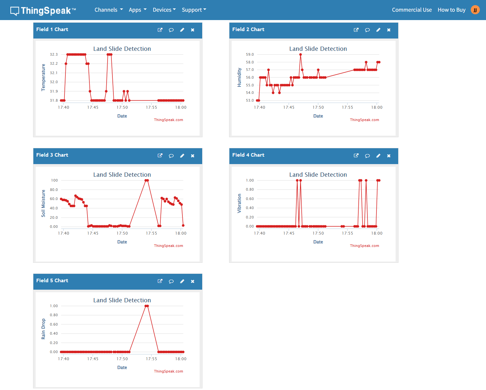

# Landslide Detection System

IoT-based early warning system for landslide-prone slopes, built on an
ESP8266 NodeMCU. Developed for **23CS2050 - Embedded Systems** at
**Karunya Institute of Technology and Sciences** (April 2025).

**Team:** Jeremiah J (URK23CS1218) · Maha Deepak S (URK23CS1220) · Nithishkumar K (URK23CS1201)

---

## Abstract

Landslides are triggered by factors such as heavy rainfall, ground
vibration, and rising soil moisture. This project builds a low-cost IoT
monitoring node that watches those precursors in real time and raises an
on-site and remote alert before conditions become dangerous. An ESP8266
NodeMCU reads soil moisture, ground vibration, rainfall, temperature, and
humidity; shows live status on an OLED display; drives a local
buzzer/LED/motor alert; logs every reading to ThingSpeak for trend
analysis; and lets a user monitor and control the system remotely
through the Blynk app.

## Features

- **Soil moisture monitoring** — analog sensor, mapped to 0-100%, with a
  3-LED status indicator (red = dry, yellow = moderate, green = wet)
- **Vibration detection** — flags ground movement and triggers a buzzer
- **Rainfall detection** — digital rain sensor for real-time rainfall events
- **Temperature & humidity** — via DHT11
- **Local alerting** — OLED live readout + buzzer + LED indicators
- **Remote alerting & control** — Blynk app, including manual relay/motor
  control via a virtual button
- **Cloud data logging** — ThingSpeak, 5 fields per reading (temperature,
  humidity, soil moisture, vibration, rain)

## System Architecture



Two logical halves, as described in the project report:

- **Environmental Monitoring** — sensors continuously sample soil
  moisture, vibration, rainfall, temperature, and humidity, and stream
  readings to the ESP8266 for processing.
- **Alert System** — when a reading crosses its threshold, the system
  raises a local alert (buzzer, LED, OLED) and pushes the event to
  Blynk and ThingSpeak so it's visible remotely.

## Hardware

See [`hardware/Components_List.md`](hardware/Components_List.md) for the
full parts list and wiring reference.

## Repository Structure

```
Landslide-Detection-System/
├── README.md
├── LICENSE
├── .gitignore
├── CHANGELOG.md
├── SECURITY.md
│
├── docs/
│   ├── Project_Report.pdf            # Full submitted project report
│   ├── Review1_Presentation.pptx     # Review 1 academic presentation
│   ├── Project_Presentation.pptx     # Project overview deck (rename if you know its exact submission stage)
│   ├── Circuit_Block_Diagram.png     # Wiring / block diagram
│   └── ThingSpeak_Results.png        # Logged sensor data (live test run)
│
├── hardware/
│   └── Components_List.md            # Parts list + wiring reference
│
├── firmware/
│   ├── LandslideDetection/
│   │   ├── LandslideDetection.ino    # Main sketch (matches the submitted report)
│   │   └── secrets.h.example         # Copy to secrets.h and fill in your own values
│   ├── experimental-gps-sms-alert/   # Not part of the submitted report — see its README
│   │   ├── gps-sms-alert.ino
│   │   ├── secrets.h.example
│   │   └── README.md
│   └── libraries.txt
│
└── images/
    └── project_outcome.jpg           # Assembled hardware prototype
```

## Getting Started

1. Install the [Arduino IDE](https://www.arduino.cc/en/software).
2. Add the ESP8266 board package and the libraries listed in
   [`firmware/libraries.txt`](firmware/libraries.txt).
3. In `firmware/LandslideDetection/`, copy `secrets.h.example` to
   `secrets.h` and fill in your own Wi-Fi, Blynk, and ThingSpeak values.
4. Open `LandslideDetection.ino`, select board **NodeMCU 1.0 (ESP-12E
   Module)**, and upload.
5. Open the matching Blynk template on your phone to monitor/control the
   relay remotely; view logged data on your ThingSpeak channel.

## Results



Live sensor data (temperature, humidity, soil moisture, vibration, rain)
logged and charted on ThingSpeak during field testing. Per the project
report's own testing notes, the system tracked soil moisture and
vibration changes reliably and delivered Blynk alerts consistently
during test runs — see `docs/Project_Report.pdf` (Chapter 5) for the
full discussion, methodology, and self-reported figures.

## Known Limitations (from the project report)

- Occasional false positives from environmental noise (e.g. splashes
  triggering the rain sensor)
- No automated multi-recipient alerting (e.g. to local authorities) yet
- GPS location tagging and GSM/SMS alerts were prototyped separately
  (see `firmware/experimental-gps-sms-alert/`) but not part of the
  validated, submitted build

## Future Work

- Integrate the GPS + SMS alert variant once tested and validated
- Explore LiDAR/radar sensing for wider terrain coverage
- Apply machine learning to historical ThingSpeak data for predictive risk scoring

## References

1. Zhang, L., Wang, Y., & Liu, H. "IoT-based Landslide Detection System Using Soil Moisture and Vibration Sensors." *Proc. Int'l Conf. on IoT and Smart Technologies*, 2022.
2. Ali, S., & Rahman, M. "Real-time Monitoring of Landslides Using IoT Technology." *Journal of Earth Science and Engineering*, 10(3), 150-158, 2021.
3. Gupta, R., & Kumar, A. "Smart Landslide Detection and Early Warning System Using IoT and Machine Learning." *International Journal of Computer Applications*, 175(15), 1-6, 2020.
4. Chen, W., Zhang, J., & Xu, L. "Application of DHT11 and Soil Moisture Sensors in Landslide Detection." *Proc. 3rd Int'l Conf. on Advanced Sensors and Applications*, 2021.
5. Patel, P., & Joshi, S. "Blynk Application for Remote Monitoring of Landslides." *International Journal of Engineering Research and Technology*, 9(7), 589-593, 2020.

## Acknowledgments

Team member Jeremiah J completed Infosys Springboard's *Internet of
Things 101* course (March 2025) as part of the project's industrial
certification component.

## License

Released under the [MIT License](LICENSE) — see file for details.
